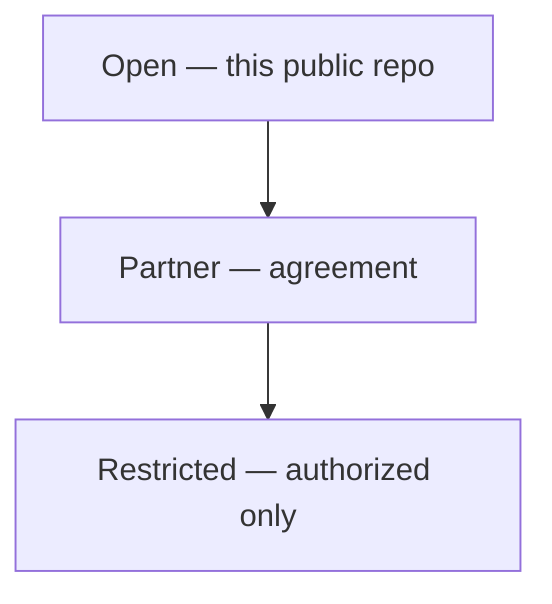

# Aerostratospheric Defense GIR

**Open Geospatial Information Repository** — public data backbone for [Aerostratospheric](https://midwestsds.com/) Defense Systems.

[](.github/workflows/daily-gir.yml)
[](LICENSE)
[](docs/DATA_POLICY.md)
[](https://midwestsds.com/)
[](docs/charts/)

> We automatically collect free, public map and hazard information, organize it, and save dated copies — without secret military data.

**Web page:** [Defense GIR](https://midwestsds.com/aerostratospheric-defense-gir.html) · **Chart gallery:** [docs/charts/](docs/charts/)

```bash
python3 scripts/generate_gir_charts.py   # rebuild SVGs from open-tier JSON
```

---

## Live visual charts

These **SVG** files are committed in git and render as images on GitHub.

### Data flow


### Ingest health


### UOGW anomalies (public research flags)


### USGS earthquakes (M2.5+, past day)


### Sentinel-2 cloud cover (indexed scenes)


### More charts

See the full set under **[docs/charts/](docs/charts/)** (airfields, USAspending, and others regenerate with the script).

---

## What is a GIR?

| Word | Meaning |
|------|--------|
| Geospatial | Facts with a place on Earth |
| Information | Quakes, alerts, satellite catalogs, cyber lists, … |
| Repository | Versioned digital filing cabinet |

Open briefing binder for the public layer of awareness — not targeting, not classified storage, not weapons.

### Access tiers



---

## Satellite & EO (open)

Library-card indexes for free imagery (Sentinel, Landsat, MODIS/VIIRS, GOES) — not a secret image vault. Path: `data/imagery_index/`.

## Military-marked public landmarks

OurAirports **keyword heuristic** (names like “Air Force Base”) — **not** an official basing list. OSM `landuse=military` sample is volunteer ODbL data only. Path: `data/defense_open/`.

## Alerts, disasters & hazards

USGS · NWS · EONET · UOGW · DONKI · FIRMS (optional key) — public hazard board. Paths: `data/events/`, `data/anomalies/`.

## Conflict context

Public: GDELT pointers, hazards, KEV, spending samples. Partner: ACLED / UCDP under license. Restricted: Aerodefener products — not in public git.

## Cyber & spending

CISA KEV + USAspending selected NAICS — open transparency data only.

---

## Automation

1. Ingest open feeds  
2. `generate_gir_charts.py` → SVG charts in `docs/charts/`  
3. Git commit when data changes  

```bash
bash scripts/daily_gir_automation.sh
```

Schedule: 06:00 & 18:00 UTC.

---

## Links

| Resource | URL |
|----------|-----|
| Defense GIR page | https://midwestsds.com/aerostratospheric-defense-gir.html |
| Defense Systems | https://midwestsds.com/aerostratospheric-defense-systems.html |
| Contact | https://midwestsds.com/contact/index.php?a=add |

Aerostratospheric is a **registered SAM.gov entity**. Passive sensing · intelligence support · communications — no kinetic weapons. Open-tier data is not an official warning service.
