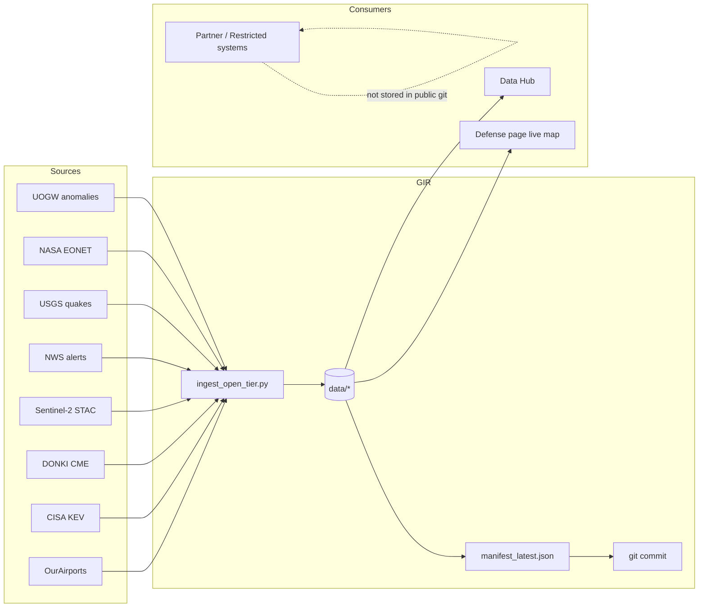
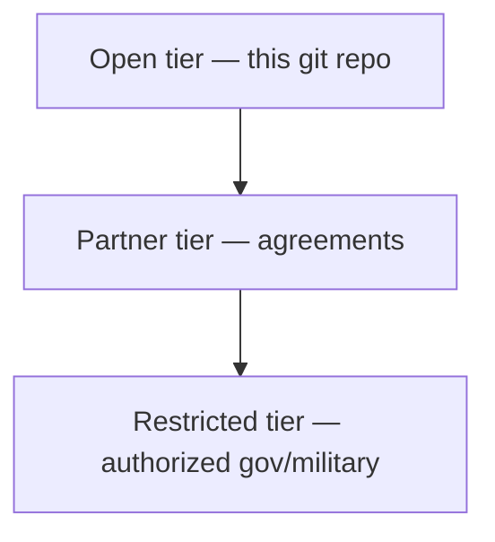
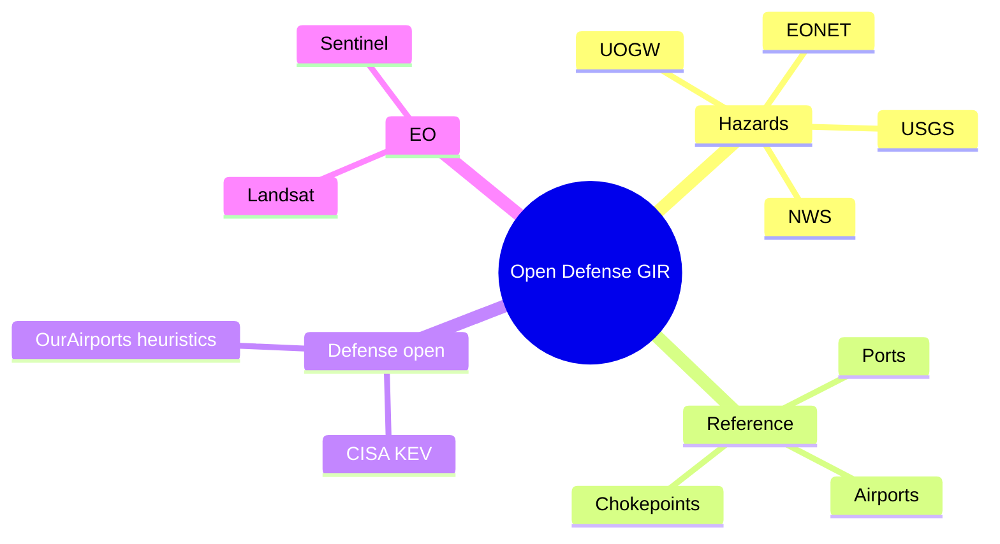

# Aerostratospheric Defense GIR

**Geospatial Information Repository** — open-tier data backbone for [Aerostratospheric](https://midwestsds.com/) Defense Systems.

[](.github/workflows/daily-gir.yml)
[](LICENSE)
[](docs/DATA_POLICY.md)
[](https://midwestsds.com/)

> Passive sensing, intelligence, and communications data architecture.  
> **Public repository = open tier only.** Partner and restricted defense products are not stored here.

---

## Live snapshot

| Metric | Value |
|--------|-------|
| Schedule | **06:00** and **18:00 UTC** daily + manual Actions dispatch |
| Sources per run | UOGW, EONET, USGS, NWS, Sentinel-2, DONKI, CISA KEV, OurAirports |


---

## What this repository is

A versioned, automated library of **public geospatial and defense-adjacent open data** that supports Aerostratospheric platforms (Aerodefener, Aerocombat concepts, defense page live map, and Secure Channel workflows).

| In this repo | Not in this repo |
|--------------|------------------|
| Public EO catalogs & STAC indexes | Classified / FOUO / CUI |
| UOGW anomalies, EONET, USGS, NWS | Targeting or kinetic products |
| CISA KEV, public airfield heuristics | Restricted Aerodefener RF products |
| Daily git automation & manifests | Export-controlled technical packages |

---

## Architecture




---

## Access tiers



| Tier | Contents | Where |
|------|----------|--------|
| **Open** | Public EO, anomalies, hazards, cyber KEV, public airfield heuristics | This repository |
| **Partner** | Controlled products under written agreement (e.g. ACLED API) | Private channels |
| **Restricted** | Aerodefener fused/sensitive products | Authorized systems only |

Details: [docs/DATA_POLICY.md](docs/DATA_POLICY.md) · [docs/OPEN_DEFENSE_DATA.md](docs/OPEN_DEFENSE_DATA.md)

---

## Repository layout

```
aerostratospheric-defense-gir/
├── schema/
├── catalog/
├── data/
│   ├── anomalies/
│   ├── events/
│   ├── imagery_index/
│   ├── reference/
│   ├── defense_open/
│   └── manifests/
├── scripts/
├── docs/
│   └── images/
└── .github/workflows/daily-gir.yml
```

---

## Visualizations (from latest open data)

### UOGW anomaly severity


### USGS earthquakes (M2.5+, past day)


### Sentinel-2 cloud cover (Casey IL index)


### Public keyword-flagged military-associated airfields by country

> Heuristic from public OurAirports names/keywords — **not** an official basing list.


---

## Daily automation — what gets written

| Source | Output path |
|--------|-------------|
| UOGW anomalies | `data/anomalies/uogw_anomalies_latest.json` |
| NASA EONET | `data/events/eonet_open_latest.json` + `.geojson` |
| USGS quakes M2.5+ day | `data/events/usgs_quakes_2.5_day_latest.geojson` |
| NWS active alerts | `data/events/nws_active_alerts_latest.geojson` |
| Sentinel-2 STAC | `data/imagery_index/sentinel2_*.json` |
| NASA DONKI CME | `data/events/donki_cme_latest.json` |
| CISA KEV | `data/defense_open/cisa_kev_latest.json` |
| OurAirports military-keyword | `data/defense_open/public_military_airfields_ourairports.*` |
| Run manifest | `data/manifests/manifest_latest.json` |

### Run locally

```bash
bash scripts/daily_gir_automation.sh
python3 scripts/ingest_open_tier.py
python3 scripts/stac_search_sentinel2.py --bbox -88.2 39.1 -87.7 39.5 --limit 10
```

### GitHub Actions

Workflow: [`.github/workflows/daily-gir.yml`](.github/workflows/daily-gir.yml)

Manual run: **Actions → Daily GIR open-tier ingest → Run workflow**

---

## Open defense data

Curated index: [`catalog/open_defense_data_sources.json`](catalog/open_defense_data_sources.json)

Strategy: [`docs/OPEN_DEFENSE_DATA.md`](docs/OPEN_DEFENSE_DATA.md)



---

## Related Aerostratospheric links

| Resource | URL |
|----------|-----|
| Homepage | https://midwestsds.com/ |
| Platforms | https://midwestsds.com/platforms.html |
| Data Hub | https://midwestsds.com/msds-data-hub.html |
| Government / military contact | https://midwestsds.com/contact/index.php?a=add |
| UOGW | https://github.com/Midwest-Stratospheric/Unified-Open-Global-Weather |

---

## License & attribution

- Repository code and original docs: [MIT](LICENSE)
- EO and government datasets remain under their original licenses
- Always attribute upstream providers

---

## Disclaimer

Open-tier products are for **research, situational awareness, and authorized planning support**. They are **not** official warning services and **not** a substitute for classified or operational command systems.

Aerostratospheric is a **registered SAM.gov entity**. Passive sensing, intelligence, and communications systems only — no kinetic weapon systems.
