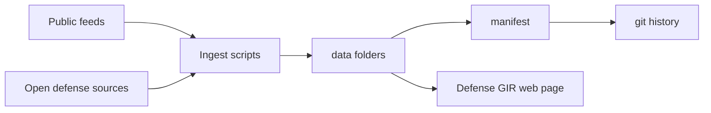
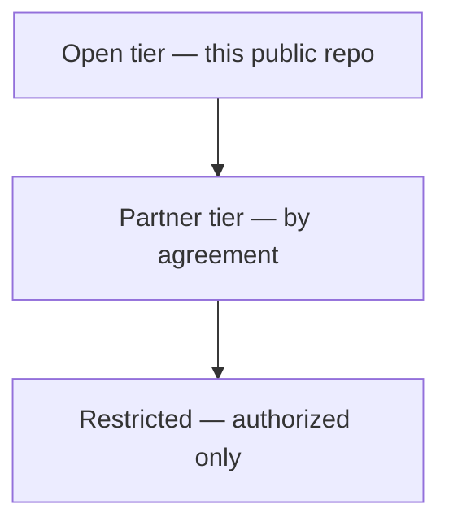
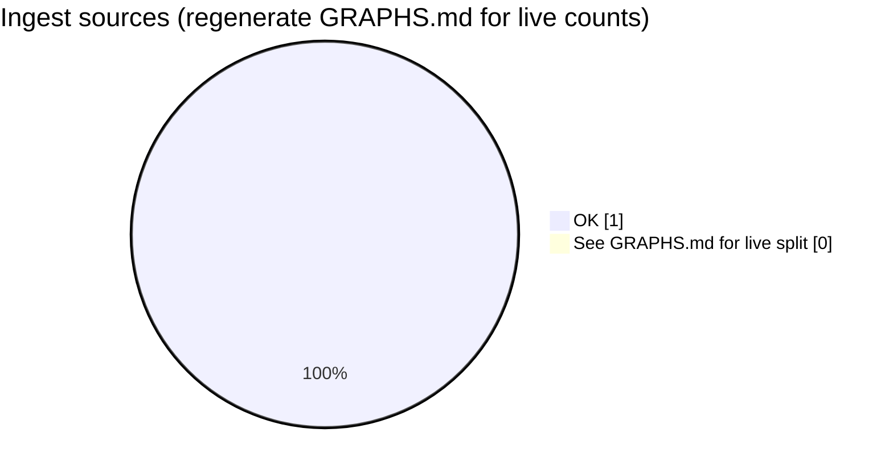

# Aerostratospheric Defense GIR

**A plain-language guide to our open Geospatial Information Repository**

[](.github/workflows/daily-gir.yml)
[](LICENSE)
[](docs/DATA_POLICY.md)
[](https://midwestsds.com/)
[](docs/GRAPHS.md)

> **In one sentence:** We automatically collect free, public map and hazard information, organize it, and save dated copies here — without secret military data.

**Live web page (satellite, hazards, military-marked public data, graphs):**  
[Defense GIR on midwestsds.com](https://midwestsds.com/aerostratospheric-defense-gir.html)

**Auto-generated Mermaid + tables:** [docs/GRAPHS.md](docs/GRAPHS.md)  
Regenerate: `python3 scripts/generate_gir_charts.py`  
*(No PNG chart binaries — broken image links removed.)*

---

## What is a GIR? (layman’s explainer)

| Word | Everyday meaning |
|------|------------------|
| **Geospatial** | Facts tied to a place on Earth |
| **Information** | Measurements and events (quakes, alerts, satellite catalogs, public cyber lists, …) |
| **Repository** | An organized digital filing cabinet with history |

This is a **shared open briefing binder** for the public layer of situational awareness — not a spy system, not weapons, not classified storage.

---

## Graphs (native git markup)

All charts are **Mermaid** (and Markdown tables) so GitHub renders them without external image files.



### Access tiers



**Layman’s version:** public museum gallery (this repo) → members’ room (partner) → vault (restricted). Sensitive Aerodefener products stay in the vault.

### Ingest health & UOGW

Run `python3 scripts/generate_gir_charts.py` after ingest to refresh pies and tables in [docs/GRAPHS.md](docs/GRAPHS.md).



---

## Satellite & Earth observation (open)

**What this is:** Free satellite programs publish catalogs of Earth photos. We store a *library card catalog* (scene IDs, time, cloud cover) for sample searches — not a secret global image vault.

**Why it matters:** Cloud cover and recent open scenes help training, open planning, and “what can an uncleared partner see?” before classified GEOINT is introduced.

| Family | Plain meaning |
|--------|----------------|
| **Sentinel-1/2/3/5P** | Radar, optical, ocean/atmosphere (Copernicus open data) |
| **Landsat** | Long-running U.S. land imagery (public domain) |
| **MODIS / VIIRS** | Daily global views; fires and thermal |
| **GOES / Himawari** | Geostationary weather satellites |

Data path: `data/imagery_index/` (e.g. Sentinel-2 STAC results).

---

## Military-marked public landmarks

**What “military-marked” means here:** We filter the public OurAirports database for *names/keywords* that sound military (e.g. “Air Force Base” in a published record). That is a **keyword heuristic**.

**What it is not:** Not an official basing list, not confirmation a site is active, not a target folder.

**Also:** OpenStreetMap features tagged `landuse=military` in a sample region (ODbL) — volunteer map data only.

Data path: `data/defense_open/public_military_airfields_ourairports.json` and OSM sample GeoJSON.

---

## Alerts, disasters & natural hazards

When people say “threat map,” the honest open-GIR version is a **public hazard board**.

| Feed | Layman meaning |
|------|----------------|
| **USGS quakes** | Recent earthquakes ~M2.5+ (what shook?) |
| **NWS alerts** | U.S. weather warnings already issued to the public |
| **NASA EONET** | Wildfires, volcanoes, storms as open science events |
| **UOGW** | Public anomaly screening on open weather fields |
| **DONKI** | Solar/space-weather notices (satellites, HF radio) |
| **FIRMS** | Fire/thermal hotspots when a MAP key is configured |

Data path: `data/events/`, `data/anomalies/`.

---

## Conflict & security context (open vs partner)

| In public git | Partner / registration (not bulk-public here) |
|---------------|-----------------------------------------------|
| GDELT last-update pointers | ACLED (API key + license) |
| Hazards, EO indexes, public landmarks | Full UCDP GED (academic terms) |
| CISA KEV, USAspending samples | Restricted Aerodefener products |

**Layman’s line:** education, research, and open planning context — **not** battlefield targeting.

---

## Cyber hygiene & public spending

| Dataset | Layman meaning |
|---------|----------------|
| **CISA KEV** | Public “patch these holes first” list for IT teams |
| **USAspending (selected NAICS)** | Public federal award samples — transparency, not classified programs |

Data path: `data/defense_open/`.

---

## Folder tour

```
data/
  anomalies/       UOGW public anomaly snapshots
  events/          EONET, USGS, NWS, DONKI
  imagery_index/   Sentinel-2 STAC search results
  reference/       Public airports, ports, chokepoints
  defense_open/    CISA KEV, airfield heuristics, USAspending, GDELT, OSM sample, stubs
  manifests/       Each run’s scorecard
docs/
  GRAPHS.md        Mermaid graphs + tables (generated)
  OPEN_DEFENSE_DATA.md
  DATA_POLICY.md
scripts/
  ingest_open_tier.py
  generate_gir_charts.py   → rewrites docs/GRAPHS.md
  daily_gir_automation.sh
```

---

## Daily automation

1. Ingest open feeds  
2. Regenerate **docs/GRAPHS.md** (Mermaid markup)  
3. Git commit if anything changed  

Schedule: **06:00** and **18:00 UTC** (+ manual Actions dispatch).

```bash
bash scripts/daily_gir_automation.sh
python3 scripts/ingest_open_tier.py
python3 scripts/generate_gir_charts.py
```

---

## Related links

| Resource | URL |
|----------|-----|
| **Defense GIR web page** | https://midwestsds.com/aerostratospheric-defense-gir.html |
| Defense Systems | https://midwestsds.com/aerostratospheric-defense-systems.html |
| Data Hub | https://midwestsds.com/msds-data-hub.html |
| Gov / military contact | https://midwestsds.com/contact/index.php?a=add |
| UOGW | https://github.com/Midwest-Stratospheric/Unified-Open-Global-Weather |

---

## License & disclaimer

- Code & original docs: [MIT](LICENSE)  
- Upstream datasets keep their own licenses — always attribute  
- Open-tier products support research, education, awareness, and authorized planning  
- **Not** an official life-safety alert service alone  
- **Not** a substitute for classified command systems  

Aerostratospheric is a **registered SAM.gov entity**. Passive sensing, intelligence support, and communications concepts only — **no kinetic weapon systems**.
