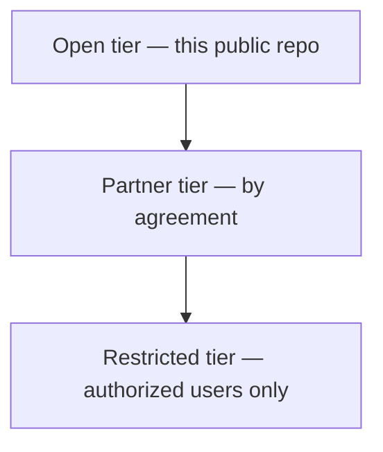
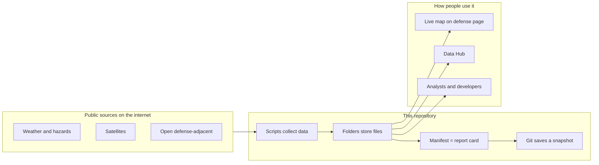

# Aerostratospheric Defense GIR

**Geospatial Information Repository** — the open data backbone for [Aerostratospheric](https://midwestsds.com/) Defense Systems.

[](.github/workflows/daily-gir.yml)
[](LICENSE)
[](docs/DATA_POLICY.md)
[](https://midwestsds.com/)

---

## What is this, in plain English?

Think of this repository as a **shared filing cabinet and weather desk** for public information that helps people understand what is happening in the air, on the ground, and in related open defense-adjacent data.

- **Geospatial** means “tied to places on Earth” (latitude, longitude, maps).
- **Information Repository** means “an organized place to keep that information, update it, and look it up later.”
- **GIR** is simply our short name for that system.

We do **not** store secret or classified military intelligence here.  
Everything in this public GitHub repo is meant to be **open**: data that governments, scientists, or the public already publish, plus our tools to collect and organize it automatically.

**Why it exists:** Aerostratospheric builds high-altitude and related systems for awareness and communications. Those systems—and the people who evaluate them—need a trustworthy, repeatable way to pull public context (storms, fires, earthquakes, open satellite scenes, public cyber alerts, and more). This repo is that pipeline.

---

## Who is it for?

| Audience | How they might use it |
|----------|------------------------|
| **Curious public / researchers** | Browse open datasets, charts, and documentation |
| **Emergency managers & analysts** | Pull public hazard and anomaly feeds in one place |
| **Government / military evaluators** | See how open-tier data is structured before discussing partner or restricted products |
| **Developers** | Run the scripts, fork the automation, build on the schema |

If you only remember one sentence: **this is the public shelf; the sensitive shelf is separate and not on the public internet.**

---

## The three “doors” (access tiers)



### Open tier (this repository)
**Layman’s version:** Anyone can look. It’s like a public library.

### Partner tier
**Layman’s version:** A locked drawer shared with organizations that signed an agreement.

### Restricted tier
**Layman’s version:** A vault for authorized government and military use only. Sensitive products are **not stored here.**

More detail: [docs/DATA_POLICY.md](docs/DATA_POLICY.md) · [docs/OPEN_DEFENSE_DATA.md](docs/OPEN_DEFENSE_DATA.md)

---

## What problems does this solve?

Without a GIR, open data is scattered across many websites. This project **pulls many public streams into one versioned place** on a schedule so you can ask: what anomalies, quakes, alerts, or satellite scenes showed up in open sources today?

Versioned means Git keeps history—yesterday’s pull is not silently overwritten without a record.

---

## How the data flows (simple picture)




1. **Sources** — Websites and APIs that already publish open data.  
2. **Scripts** — Small programs that download and tidy that data.  
3. **Folders** — Where the files land.  
4. **Manifest** — A short summary of what succeeded or failed.  
5. **Git commit** — A saved checkpoint with a timestamped note.

---

## What’s inside the filing cabinet

```
aerostratospheric-defense-gir/
├── schema/           ← The rulebook: what fields mean
├── catalog/          ← Lists of sources
├── data/
│   ├── anomalies/    ← Public anomaly flags (e.g. UOGW)
│   ├── events/       ← Quakes, storms, space weather, natural events
│   ├── imagery_index/← Which satellite scenes exist (not full image vaults)
│   ├── reference/    ← Airports, ports, chokepoints (public)
│   ├── defense_open/ ← Cyber KEV, airfield heuristics, awards, OSM sample
│   └── manifests/    ← Each run’s report card
├── scripts/          ← The robots that fetch and save
├── docs/             ← Policies + charts
└── .github/workflows/← Cloud schedule
```

### Folder explainers

**`data/anomalies`** — Dashboard-style public flags (for example UOGW), not classified tracks.  
**`data/events`** — Earthquakes, U.S. weather alerts, NASA natural events, space-weather CMEs.  
**`data/imagery_index`** — Search results and metadata for satellite scenes; download imagery under each provider’s rules.  
**`data/reference`** — Stable public map facts.  
**`data/defense_open`** — Public cyber lists, keyword-heuristic airfields, USAspending samples, OSM samples, and status files for OpenSky/FIRMS/partner datasets.  
**`data/manifests`** — JSON report card after each automated run.

---

## Visualizations


**Layman’s read:** Green means that source downloaded successfully on the latest run.


**Layman’s read:** How many public anomaly flags fell into alert / watch / info style buckets.


**Layman’s read:** Recent quake sizes from the USGS public feed.


**Layman’s read:** Cloud cover for indexed Midwest Sentinel-2 scenes—lower usually means a clearer photo.


**Layman’s read:** Counts from public OurAirports using name/keyword clues. **Not an official basing list.**

---

## What gets updated every day?

Automation runs **twice daily** (06:00 and 18:00 UTC) plus manual **Run workflow**.

| Plain-language name | Source | Folder |
|---------------------|--------|--------|
| Public anomaly board | UOGW | `data/anomalies/` |
| World natural events | NASA EONET | `data/events/` |
| Earthquakes | USGS | `data/events/` |
| U.S. weather alerts | NWS | `data/events/` |
| Satellite scene search | Sentinel-2 STAC | `data/imagery_index/` |
| Space-weather CMEs | NASA DONKI | `data/events/` |
| Known exploited bugs | CISA KEV | `data/defense_open/` |
| Military-keyword airfields | OurAirports | `data/defense_open/` |
| Defense-related federal awards (sample) | USAspending | `data/defense_open/` |
| Global news-event file pointers | GDELT | `data/defense_open/` |
| Aircraft broadcasting ADS-B (sample region) | OpenSky | best-effort |
| Map features tagged military (sample area) | OpenStreetMap | `data/defense_open/` |
| Active fire heat detections | NASA FIRMS | if `FIRMS_MAP_KEY` set |
| Run report card | Manifest | `data/manifests/` |

Partner-only (not auto-published here): ACLED (API key + license), UCDP full extracts, restricted Aerodefener products.

---

## Running it yourself

```bash
bash scripts/daily_gir_automation.sh
python3 scripts/ingest_open_tier.py
python3 scripts/stac_search_sentinel2.py --bbox -88.2 39.1 -87.7 39.5 --limit 10
```

**Bbox** = west, south, east, north map rectangle.  
**STAC** = common card-catalog standard for satellite imagery search.

---

## GitHub Actions — the cloud alarm clock

File: [`.github/workflows/daily-gir.yml`](.github/workflows/daily-gir.yml)

GitHub wakes a temporary computer twice a day, runs fetch scripts, and commits when something new appears.

Optional secrets: `FIRMS_MAP_KEY`, `ACLED_API_KEY` (private/licensed use only).

---

## Open defense data — careful definition

Here, “defense data” means **already public** information for awareness, planning, cyber hygiene, or research—**not** secret movements, targeting folders, or classified imagery.

| Public GIR (here) | Private / restricted |
|-------------------|----------------------|
| Library newspaper rack | Sealed evidence locker |

[docs/OPEN_DEFENSE_DATA.md](docs/OPEN_DEFENSE_DATA.md) · [catalog/open_defense_data_sources.json](catalog/open_defense_data_sources.json)

---

## How this connects to Aerostratospheric products

| Concept | Role | How the GIR helps |
|---------|------|-------------------|
| **Aerodefener** | High-altitude passive awareness and relay concept | Open context layers; sensitive detections stay restricted |
| **Aerocombat (2027)** | Low-altitude intel + defensive obscuration concept | Shared map/time language |
| **Defense page live map** | Public anomaly picture | Open feeds such as UOGW |
| **Secure Channel** | In-browser encryption for notes | Protects messages; GIR organizes open data |

Site: [midwestsds.com](https://midwestsds.com/) · [Contact](https://midwestsds.com/contact/index.php?a=add)

---

## Glossary

| Term | Plain meaning |
|------|----------------|
| **API** | Machine-friendly doorway to a website’s data |
| **ADS-B** | Radio signals many aircraft broadcast about position |
| **CME** | Burst of solar material; space weather |
| **GeoJSON** | Common map file shape |
| **Heuristic** | Rule of thumb, not a perfect official definition |
| **NAICS** | U.S. industry codes for economic/spending data |
| **ODbL** | OpenStreetMap share-alike license |
| **STAC** | Catalog standard for satellite items |

---

## License, credit, disclaimer

- Code and original docs: [MIT](LICENSE)  
- Upstream datasets keep their own licenses—always give credit  
- Open-tier files are for research, education, situational awareness, and authorized planning support  
- **Not** an official warning service and **not** a substitute for classified systems  

Aerostratospheric is a **registered SAM.gov entity**. Passive sensing, intelligence, and communications concepts only—**no kinetic weapon systems** in this program framing.

---

**Bottom line:** This GIR is a public, automated, honest shelf of open geospatial and defense-*adjacent* context—so humans and machines can share the same picture without crossing into classified territory.
