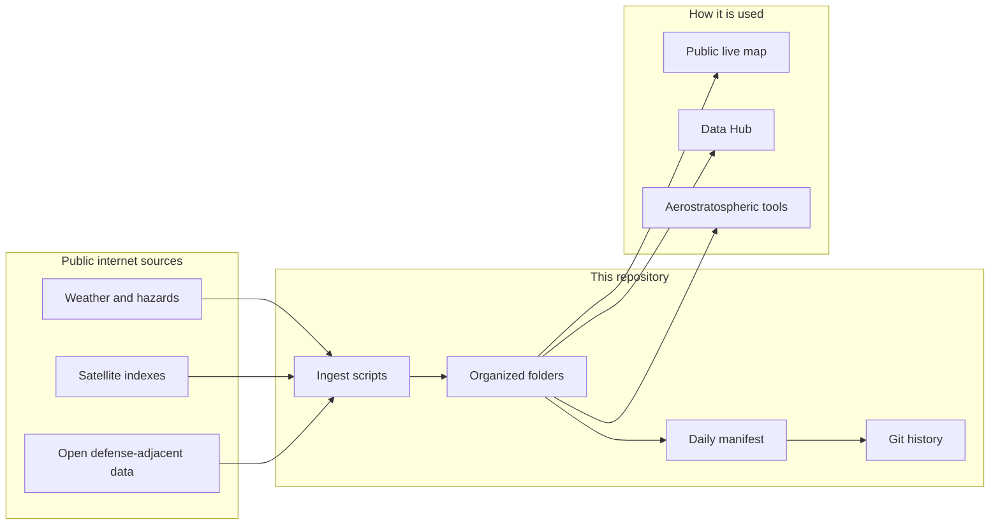

# Aerostratospheric Defense GIR

**A plain-language guide to our open Geospatial Information Repository**

[](.github/workflows/daily-gir.yml)
[](LICENSE)
[](docs/DATA_POLICY.md)
[](https://midwestsds.com/)

This repository is the **public data backbone** for [Aerostratospheric](https://midwestsds.com/) Defense Systems.  
It is written so a non-specialist can understand **what it is, why it exists, and what each piece does**.

> **In one sentence:**  
> We automatically collect free, public maps and hazard information from the internet, organize it, and save dated copies here so people and systems can use a clear, honest picture of the world — without any secret military data.

---

## What is a “GIR”? (layman’s explainer)

**GIR** means **Geospatial Information Repository**.

| Word | Everyday meaning |
|------|------------------|
| **Geospatial** | Information that has a place on Earth — a latitude and longitude, a region, a path |
| **Information** | Facts and measurements: heat anomalies, storms, earthquakes, aircraft that broadcast their position, public contract records, and more |
| **Repository** | A library or filing cabinet that stores those facts in an organized way |

So this repo is a **shared digital filing cabinet of public place-based data**.

It is **not** a spy system, **not** a weapons system, and **not** a store of classified secrets.  
It is closer to a **weather-and-world dashboard’s source folder** that updates itself on a schedule.

---

## Why does Aerostratospheric need this?

Aerostratospheric builds **high-altitude and related observation concepts** (for example Aerodefener — a “quiet eye” in the stratosphere idea) and tools like a **live anomaly map** and **Secure Channel** encryption demo on the defense page.

Those products need **context data** from the public world. The GIR is where that **public context** lives, versioned by git, refreshed by automation, and open to audit.

**Layman’s analogy:** If a pilot uses both instruments *and* a public weather briefing, the GIR is more like the **weather briefing binder** — not the classified mission folder.

---

## The most important rule: open vs restricted

| Tier | Who it’s for | What’s in it | In this public GitHub repo? |
|------|----------------|--------------|------------------------------|
| **Open** | Anyone | Free public feeds, open research, public government data | **Yes** |
| **Partner** | Organizations with a written agreement | Extra datasets under license | **No** |
| **Restricted** | Authorized government / military users | Sensitive products from our own sensors (when fielded) | **No** |

**Layman’s explainer:** Think of a museum. The **open gallery** is this repo. The **members’ room** is partner data. The **vault** is restricted data. We do not put vault contents on a public website.

Details: [docs/DATA_POLICY.md](docs/DATA_POLICY.md) · [docs/OPEN_DEFENSE_DATA.md](docs/OPEN_DEFENSE_DATA.md)

---

## What “defense data” means here (and what it doesn’t)

### What we *do* store
Public weather and hazard alerts, earthquake lists, satellite *indexes*, public cyber vulnerability catalogs, public federal spending samples, public map features already published elsewhere.

### What we *do not* store
Classified material, secret unit locations, targeting folders, weapons instructions, or anything we are not allowed to republish.

**Layman’s explainer:** If you could lawfully find it on a government or open-science website and share the link, it may belong in the **open** GIR. If you would need a security clearance to see it, it does **not** belong here.

---

## Architecture in plain language




1. **Sources** publish free data.  
2. **Ingest scripts** download those feeds.  
3. Files land in **folders**.  
4. A **manifest** records success or failure.  
5. **Git** keeps a dated history when something changes.  
6. Websites and tools **read** the files for maps and briefings.

---

## Live snapshot

Updates about **06:00** and **18:00 UTC** daily, plus manual Actions runs.


**Layman’s explainer:** The chart shows whether each “hose” of data was flowing on the last check.

---

## Folder tour

### `data/anomalies/` — Is anything odd in the open weather picture?
UOGW public anomaly reports. Research-style flags, not official phone alerts.


### `data/events/` — What public hazard events are active?
NASA EONET, USGS earthquakes, NWS alerts, NASA DONKI space weather.


### `data/imagery_index/` — Which free satellite pictures cover an area?
Sentinel-2 catalog results (library cards), not a full planet image vault.


### `data/reference/` — Fixed public landmarks
Airports, ports, maritime chokepoints — map pins everyone can already look up.

### `data/defense_open/` — Open defense-adjacent public data

| Dataset | Plain meaning |
|---------|---------------|
| **CISA KEV** | Software holes attackers already use — patch these first |
| **OurAirports military-keyword** | Public airport records with military-sounding names — **not** an official secret base list |
| **USAspending NAICS** | Public federal contract samples in aerospace/defense-related codes |
| **GDELT lastupdate** | Pointers to global public news-event data files |
| **OpenSky** | Aircraft that broadcast ADS-B in a sample region |
| **OSM military landuse** | Volunteer map tags in a sample region (ODbL) |
| **FIRMS** | Satellite fire detections when `FIRMS_MAP_KEY` is set |
| **UCDP / ACLED stubs** | Notes for academic/partner datasets that need registration or licenses |


---

## Daily automation — how the robots work

1. Wake up on schedule  
2. Run `scripts/ingest_open_tier.py`  
3. Save files  
4. Write a manifest  
5. Commit to git if anything changed  

**Layman’s explainer:** A newspaper delivery route. Same stops each day. If a stop is closed, the scorecard marks failure and the route continues.

```bash
bash scripts/daily_gir_automation.sh
python3 scripts/ingest_open_tier.py
```

Optional secrets: `FIRMS_MAP_KEY`, `ACLED_API_KEY` (private/licensed use only).

---

## Schema and catalogs

- **Schema** = form template for records ([`schema/gir_schema_v1.json`](schema/gir_schema_v1.json))  
- **Catalogs** = phone books of sources ([`catalog/`](catalog/))

---

## How this connects to products

| Product | How the GIR helps |
|---------|-------------------|
| **Aerodefener** | Public background context; sensitive sensor products stay restricted |
| **Aerocombat (2027 concept)** | Shared map/time language for planning context |
| **Defense page live map** | Reads open anomaly JSON for the public layer |
| **Secure Channel** | Protects notes; GIR stores open data |
| **Data Hub** | Human doorway into open datasets |

**Layman’s explainer:** The GIR is the shared notebook of public facts. Platforms and pages are the apps that read the notebook.

---

## Partner and restricted data

Licensed or sensitive data belongs in agreements or a **private** repo (suggested: `aerostratospheric-defense-gir-restricted`), not this public tree.

---

## Related links

| What | Where |
|------|--------|
| Home | https://midwestsds.com/ |
| Platforms | https://midwestsds.com/platforms.html |
| Data Hub | https://midwestsds.com/msds-data-hub.html |
| Contact | https://midwestsds.com/contact/index.php?a=add |
| UOGW | https://github.com/Midwest-Stratospheric/Unified-Open-Global-Weather |

---

## Glossary

| Term | Plain meaning |
|------|----------------|
| **ADS-B** | Radio signal many aircraft broadcast: “here I am” |
| **Anomaly** | A measurement that looks unusual |
| **API** | Machine-friendly doorway to data |
| **Commit** | A saved checkpoint in git |
| **Git** | Software that tracks file history |
| **Ingest** | Download data and file it |
| **Manifest** | Short report of a batch job |
| **NAICS** | U.S. industry category codes |
| **OSM** | OpenStreetMap — volunteer world map |
| **STAC** | Standard search catalog for satellite scenes |
| **Tier** | Access level: open, partner, or restricted |

---

## License, credit, disclaimer

- Code and original docs: [MIT](LICENSE)  
- Upstream data stays under original licenses — always give credit  
- Open-tier products support research, education, awareness, and authorized planning  
- **Not** an official life-safety alert service alone  
- **Not** a substitute for classified command systems  

Aerostratospheric is a **registered SAM.gov entity**. Passive sensing, intelligence, and communications concepts only — **no kinetic weapon systems**.

---

## Three things to remember

1. **This repo is a public library of place-based open data.**  
2. **It updates automatically and keeps history.**  
3. **Secret and sensitive defense products stay out of the public library on purpose.**

Government and military inquiries: https://midwestsds.com/contact/index.php?a=add
