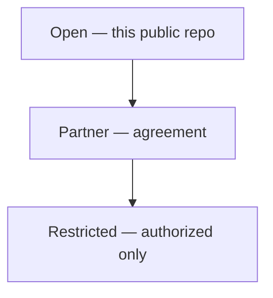

# Aerostratospheric Defense GIR

**A plain-language guide to our open Geospatial Information Repository**

[](.github/workflows/daily-gir.yml)
[](LICENSE)
[](docs/DATA_POLICY.md)
[](https://midwestsds.com/)
[](docs/charts/)
[](reports/latest.md)
[](CONTRIBUTING.md)

> **In one sentence:** We automatically collect free, public map and hazard information, organize it, and save dated copies here — without secret military data.

**Live web page:** [Defense GIR on midwestsds.com](https://midwestsds.com/aerostratospheric-defense-gir.html) · **Charts:** [docs/charts/](docs/charts/) · **Status JSON:** [data/status/](data/status/) · **Latest report:** [reports/latest.md](reports/latest.md) · **Data packages:** [docs/DATA_PACKAGES.md](docs/DATA_PACKAGES.md)

---

## What is this, in plain English?

Imagine you need a **shared notebook of public facts about the world**—storms that were already warned about, earthquakes that already happened, free satellite “library cards,” public cyber patch lists, and open research balloon flight summaries. You do **not** want secrets. You want something you can audit, re-run, and explain to a non-specialist.

That notebook is this repository.

**GIR** means **Geospatial Information Repository**: place-based information stored in an organized library. Software here downloads free public feeds on a schedule, checks whether the download worked, keeps a short history in git, draws simple charts, publishes a **US open-status** summary for the website banner, and writes a **daily executive summary**. Partner or restricted sensor products from Aerostratospheric platforms (when fielded) stay **out** of this public tree on purpose.

Think of it as the **weather-and-world briefing binder** that sits beside more sensitive tools—not the classified mission folder, not a weapons system, and not a substitute for official emergency alerts on your phone.

| Word | Everyday meaning |
|------|------------------|
| **Geospatial** | Facts tied to a place on Earth |
| **Information** | Measurements and events (quakes, alerts, satellite catalogs, public cyber lists, flight log summaries, …) |
| **Repository** | An organized digital filing cabinet with history |

---

## Daily data packages

Every successful automation run produces a coherent open-tier package:

| Area | Location |
|------|----------|
| Manifest (ok/total per source) | `data/manifests/manifest_latest.json` |
| UOGW anomalies | `data/anomalies/` |
| Hazards (EONET, USGS, NWS, DONKI) | `data/events/` |
| Sentinel-2 STAC index | `data/imagery_index/` |
| Defense-open samples (CISA KEV, OpenSky, OurAirports, …) | `data/defense_open/` |
| US open-status banner | `data/status/` |
| Charts (SVG + Mermaid) | `docs/charts/`, `docs/GRAPHS.md` |
| Executive summary | `reports/daily/`, `reports/latest.md` |

Full map: **[docs/DATA_PACKAGES.md](docs/DATA_PACKAGES.md)** · Feature catalog: **[docs/FEATURES.md](docs/FEATURES.md)**

---

## How it is used (sample use cases)

These examples are **open-tier** only. They describe realistic ways people and programs use this kind of public data—not targeting, not classified operations.

### 1. Morning open briefing for a small research team
A Midwest balloon or environmental team opens the [GIR web page](https://midwestsds.com/aerostratospheric-defense-gir.html), checks the **US open status** strip (GREEN/YELLOW/…), skims the [latest exec report](reports/latest.md), and notes whether any **public research flight** is marked active in the flight log.

### 2. “What can an uncleared partner already see?”
Before a partner discussion, staff review the **Sentinel-2 index** and public hazard layers. That answers a simple question in lay terms: *which free satellite scenes and public alerts already exist for this region?*

### 3. Classroom or STEM outreach
A teacher uses the earthquake magnitude chart and EONET categories to show how open science feeds work. Students learn that “defense-adjacent” public data can mean **weather, disasters, and transparency lists**—not secret bases.

### 4. Cyber hygiene desk check
An IT lead glances at the **CISA KEV** sample in `data/defense_open/`. It is a public “patch these known-exploited holes first” catalog.

### 5. Flight log continuity for public launches
When Aerostratospheric publishes a **public** balloon event summary, it is appended to `data/flight_logs/`.

### 6. Automation and reproducibility
```bash
python3 scripts/ingest_open_tier.py
python3 scripts/compute_us_open_status.py
python3 scripts/generate_gir_charts.py
python3 scripts/generate_daily_exec_summary.py
# or:
bash scripts/daily_gir_automation.sh
```

### 7. Grant / SAM.gov narrative support
Open GIR materials illustrate a responsible open-data posture: public inputs, clear tiers, disclaimers, and no claim to replace NWS, USGS, or military command systems.

**Non-use cases (on purpose):** sole life-safety alerting, classified basing lists, targeting folders, or kinetic system control.

---

## Executive reports

Open-tier **daily executive summaries** are generated automatically by the same GitHub Actions pipeline.

| Resource | Link |
|----------|------|
| **Latest summary** | [reports/latest.md](reports/latest.md) |
| **Daily archive** | [reports/daily/](reports/daily/) |

Weekly roll-ups can be added to the same pipeline later if needed.

---

## Live visual charts

```bash
python3 scripts/generate_gir_charts.py
```

See **[docs/charts/](docs/charts/)** for the full category gallery.

---

## Access tiers



---

## Related open ecosystem

| Repository | Role |
|------------|------|
| [Unified-Open-Global-Weather](https://github.com/Midwest-Stratospheric/Unified-Open-Global-Weather) | Multi-layer atmospheric commons + anomaly report |
| [msds-data](https://github.com/Midwest-Stratospheric/msds-data) | Casey ground weather + planned HAB flight packages |
| [International-Ground-Data-Repository](https://github.com/Midwest-Stratospheric/International-Ground-Data-Repository) | IGRA / international ground indexes |
| [x2griffon](https://github.com/Midwest-Stratospheric/x2griffon) | Payload platform documentation |

---

## What’s inside (short tour)

| Area | Plain meaning |
|------|----------------|
| **Satellite / EO** | Library-card indexes for free imagery (Sentinel, …) |
| **Military-marked (public)** | Keyword heuristics on public airport names — **not** official basing |
| **Alerts & hazards** | USGS, NWS, EONET, UOGW, DONKI |
| **Cyber & spending** | CISA KEV + USAspending samples |
| **Flight logs** | Public research balloon / test summaries |
| **US open status** | Banner levels from public feeds only — **not** DEFCON |
| **Executive reports** | Daily open-tier briefing summaries |

---

## Automation

```bash
bash scripts/daily_gir_automation.sh
```

Schedule: **06:00** and **18:00 UTC** (plus manual Actions dispatch).

Pipeline: open-tier ingest → US open-status → charts → daily executive summary → git commit.

Details: [docs/DAILY_AUTOMATION.md](docs/DAILY_AUTOMATION.md)

---

## Repository hygiene

| Doc | Purpose |
|-----|---------|
| [CONTRIBUTING.md](CONTRIBUTING.md) | How to propose changes (open-tier only) |
| [SECURITY.md](SECURITY.md) | How to report vulnerabilities |
| [CITATION.cff](CITATION.cff) | Formal citation |
| [docs/DATA_POLICY.md](docs/DATA_POLICY.md) | What may / may not enter the tree |
| [docs/DATA_PACKAGES.md](docs/DATA_PACKAGES.md) | Package map for data consumers |
| [docs/FEATURES.md](docs/FEATURES.md) | Full feature catalog |

---

## Links

| Resource | URL |
|----------|-----|
| Defense GIR page | https://midwestsds.com/aerostratospheric-defense-gir.html |
| Defense Systems | https://midwestsds.com/aerostratospheric-defense-systems.html |
| Latest exec report | [reports/latest.md](reports/latest.md) |
| Daily report archive | [reports/daily/](reports/daily/) |
| Data packages guide | [docs/DATA_PACKAGES.md](docs/DATA_PACKAGES.md) |
| Contact | https://midwestsds.com/contact/index.php?a=add |

Aerostratospheric is a **registered SAM.gov entity**. Passive sensing · intelligence support · communications — **no kinetic weapons**. Open-tier data is not an official warning service alone.
