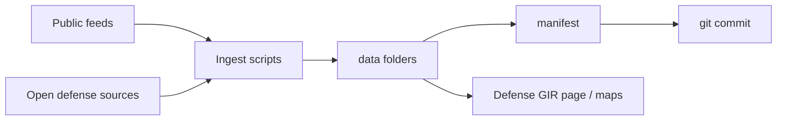
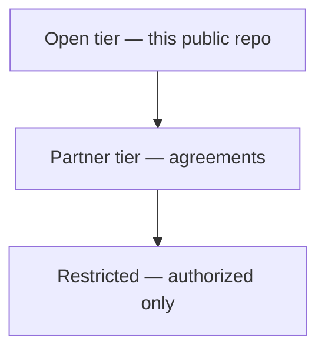

# GIR graphs (git markup)

_Generated from open-tier data. Mermaid only — no image binaries._

Regenerate:

```bash
python3 scripts/generate_gir_charts.py
```

## Data flow



## Access tiers



## Daily ingest status

Run ingest then regenerate to fill live pies and tables from `data/manifests/manifest_latest.json`.

## UOGW anomaly severity

Public anomaly flags (research-style). Not official emergency alerts.

## USGS earthquakes (M2.5+, past day)

From `data/events/usgs_quakes_2.5_day_latest.geojson` after ingest.

## Public keyword-flagged airfields by country

> Heuristic from public OurAirports names/keywords — **not** an official basing list.

## Sentinel-2 scene index (sample region)

Cloud cover for indexed free EO scenes (catalog pointers, not a full image vault).

## USAspending sample (selected NAICS)

Public federal award samples only — not classified program data.

## CISA Known Exploited Vulnerabilities

Public cyber hygiene list — patch prioritization context.

---

Open tier only. See [OPEN_DEFENSE_DATA.md](OPEN_DEFENSE_DATA.md) and [DATA_POLICY.md](DATA_POLICY.md).
