# GIR visual charts — all categories

_Git-native SVG · open tier only_

```bash
python3 scripts/generate_gir_charts.py
```

## Overview
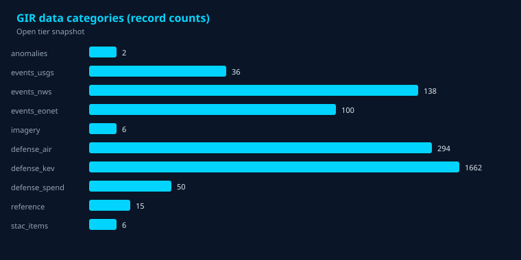
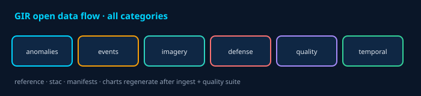

## Manifests
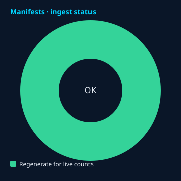
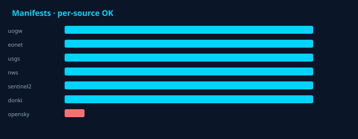


## Anomalies
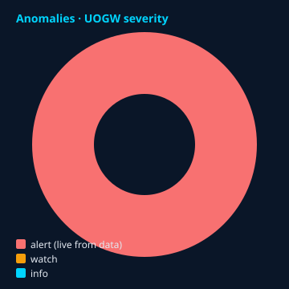
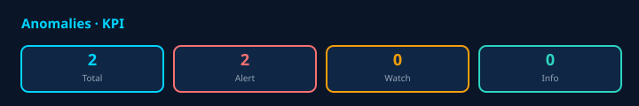

## Events
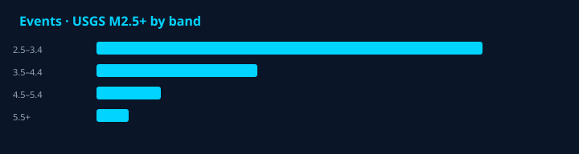
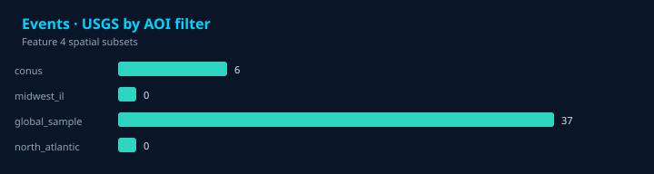
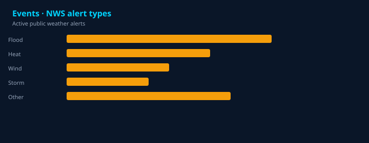
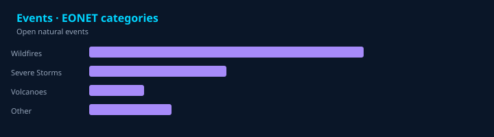


## Imagery & STAC
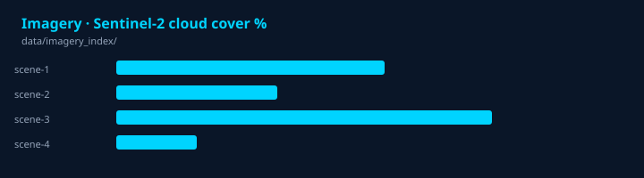


## Defense-open
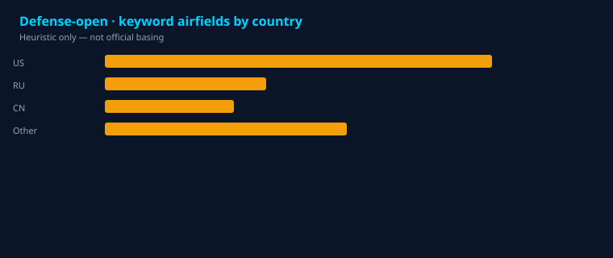

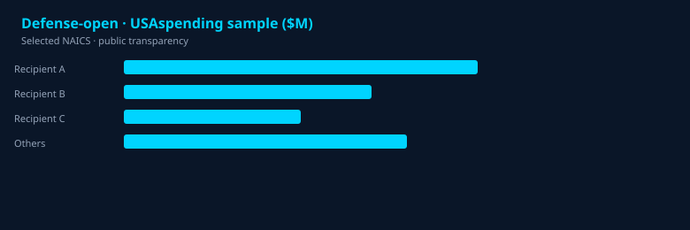

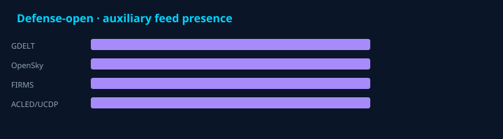

## Reference


## Quality & temporal
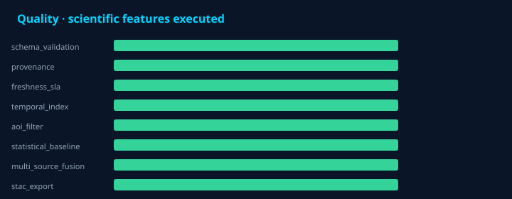


